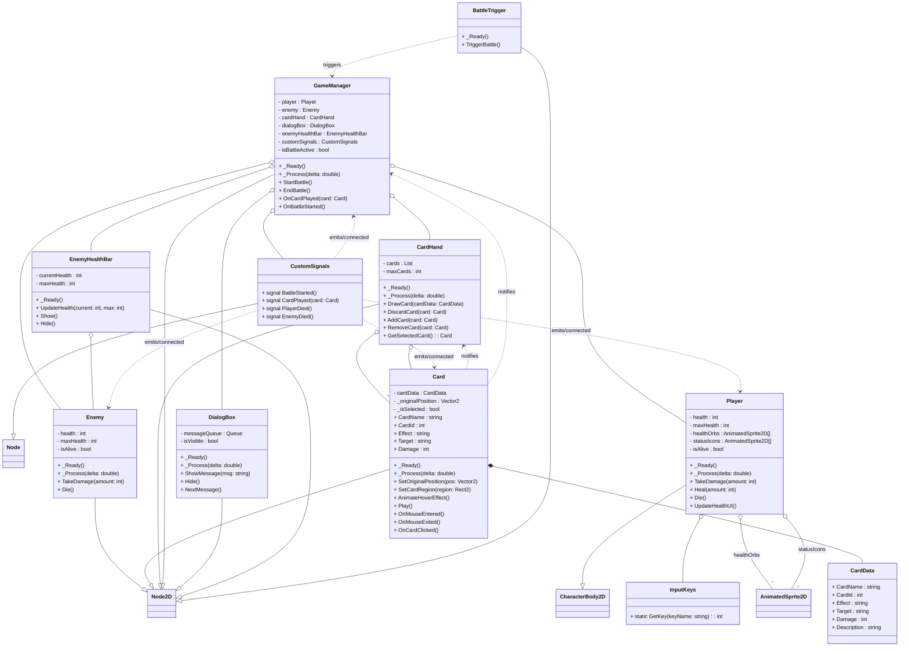

# Folklore Terror

## Opis
* __Karciana__ gra __RPG__ wykorzystująca elementy _Roguelike'ów_.
* Motywem przewodnim jest __Horror__ oraz __Paraliż Senny__.

## Cel Projektu:
* Poszerzenie puli umiejętności praktycznych w zakresie m.in. __programowania__, __tworzenia "asset'ów"__, __opowiadania historii__ oraz __marketingu__.
* Stworzenie konkretnego przykładu pracy, który można zaprezentować przyszłym pracodawcom jako dowód posiadanych umiejętności i doświadczenia.
* Stworzenie produktu, który potencjalnie mógłby zostać wydany jako pełnoprawna gra.

## Fabuła
* Leżysz bezwładnie w łóżku, ciężki sen ustępuje miejsca _paraliżującemu strachowi_. Powieki są zbyt __ciężkie__, by je podnieść, a ciało odmawia posłuszeństwa. To __paraliż senny__. Ale tej nocy nie jesteś _sam_. Z mroku wyłaniają się __koszmarne zjawy__, czerpiące swą moc z najmroczniejszych zakamarków __ludowej wyobraźni__. _Nosferatu_ o przeszywającym spojrzeniu, _Baba Jaga_ z jej kościstą dłonią, _Drakula_ z jego hipnotycznym urokiem – te i inne monstra zbliżają się, a jedyną twoją bronią są przebłyski świadomości i resztki woli, ucieleśnione w postaci __kart umiejętności__.

## Rozgrywka
* W _"Folklore Terror"_ każda runda reprezentuje __narastający atak koszmaru__. Na początku każdej rundy __losujesz karty stworów__, które będą cię nękać. Każdy stwór posiada unikalne statystyki i zdolności specjalne, od wysysania energii po paraliżowanie twoich zmysłów.
* Twoją jedyną linią obrony jest _talia kart umiejętności_. __Karty__ te reprezentują różne __aspekty twojej psychiki__ i __przebłyski świadomości__, które możesz wykorzystać, by odeprzeć atak. Znajdziesz wśród nich karty takie jak:
  1. _Wola Walki_: Pozwala na chwilowe odparcie ataku i zmniejszenie strachu.
  2. _Racjonalizacja_: Podważa nadprzyrodzoną naturę potworów, osłabiając ich.
  3. _Jasny Umysł_: Umożliwia przewidzenie ruchu wroga i uniknięcie jego ataku.
  4. _Wspomnienie Bliskich_: Dodaje otuchy i wzmacnia twoją obronę.
  5. _Przenikliwy Krzyk_: Ogłusza potwora na jedną turę.
* W swojej turze zagrywasz __karty umiejętności__, starając się zneutralizować zagrożenie ze strony nadciągających _monstrów_. Musisz strategicznie zarządzać swoimi __zasobami__ i przewidywać ruchy wrogów. Niektóre karty mogą być __bardziej efektywne__ przeciwko konkretnym __typom potworów__. Na przykład, _"Światło Księżyca"_ może osłabić __Nosferatu__, a _"Zioła Ochronne"_ mogą zdezorientować __Babę Jagę__.
* Jeśli nie uda ci się odeprzeć wszystkich atakujących stworów, ich obecność zwiększy poziom twojego __strachu__. Jeśli poziom strachu osiągnie _krytyczny punkt_, koszmar cię pochłonie i __przegrywasz__.
* Gra oferuje różne poziomy trudności, wprowadzając coraz bardziej złożone kombinacje potworów i ograniczając twoje zasoby. Możesz także odblokowywać nowe karty umiejętności w miarę postępów, odkrywając nowe sposoby na walkę z nocnymi marami.

  
* _"Folklore Terror"_ to klimatyczna i trzymająca w napięciu gra karciana, która łączy mechanikę strategiczną z mroczną atmosferą ludowych legend i klaustrofobicznym doświadczeniem paraliżu sennego. Czy zdołasz pokonać demony nocy? Czy może ich mroczna obecność stanie się twoją _wieczną rzeczywistością?_

## Wykorzystany folklor, stwory (lista może ulec zmianie):
* Banshee
* Medusa
* Baba Yaga
* Nosferatu
* Chupacabra
* Kraken
* Dracula
* Nuckelavee
* Dullahan
* Manticore
* Wendigo
* Skinwalker

## Technologie
### __Silnik Gry__: 
* Do stworzenia gry użyję popularnego silnika __Godot Engine__. Zdecydowałem się na ten wybór ze względu na __łatwy dostęp__, __niskie wymagania__ oraz dostępną i dobrze napisaną __dokumentację__.
* Używanym językiem programowania będzie __C#__.
### __Grafika__:
* Gra będzie używać prostych grafik w stylu __PixelArt__ stworzonych przeze mnie w programie __Aseprite__.
### __Muzyka__: 
* Do tworzenia muzyki oraz efektów dźwiękowych wykorzystam program __Ableton Live__ wraz z instumentami VST __LABS__ oraz __Native Instuments__. Pluginy te mają szeroką gamę tzw. _Dźwięków Ambient'owych_, które będą kluczowe by oddać terror rozgrywki.
### __Inne__: 
* Github oraz Git do zarządzania projektem.
### __Wsparcie__: 
* Gra będzie wspierała jedynie środowisko __Windows__ oraz język __Polski__.

## Czym jest silnik Godot Engine?

Godot Engine to dynamicznie rozwijający się silnik, który oferuje kompleksowe narzędzia do tworzenia gier bez żadnych kosztów licencyjnych. Jego otwartość, elastyczność i aktywna społeczność sprawiają, że jest to atrakcyjny wybór dla każdego, kto chce tworzyć gry, niezależnie od poziomu zaawansowania.

* Otwartoźródłowy i darmowy: Godot jest dostępny na licencji MIT, co oznacza, że jest całkowicie darmowy do użytku komercyjnego i niekomercyjnego. Nie ma żadnych ukrytych opłat ani tantiem od sprzedaży gier. Kod źródłowy jest publicznie dostępny, co pozwala na jego modyfikację i rozwijanie przez społeczność.

* System scen i węzłów: Godot opiera się na unikalnej architekturze scen i węzłów. Każdy element gry (postać, obiekt, dźwięk, interfejs użytkownika) jest węzłem, który może być grupowany w sceny. Sceny mogą być zagnieżdżane i ponownie używane, co ułatwia organizację projektu i tworzenie złożonych struktur.

* Wbudowane języki skryptowe: Głównym językiem skryptowym Godot jest GDScript, który jest językiem o składni zbliżonej do Pythona, zaprojektowanym specjalnie do pracy z silnikiem Godot. Jest łatwy do nauki i bardzo efektywny. Oprócz GDScript, Godot obsługuje również C# (dla bardziej zaawansowanych projektów i deweloperów Unity/Unreal) oraz C++ (przez GDExtension, dla najwyższej wydajności).

* Potężne narzędzia do 2D: Godot słynie z doskonałych narzędzi do tworzenia gier 2D. Oferuje m.in. edytor kafelków (tilemap editor), system animacji, wykrywanie kolizji 2D oraz system cząsteczek.

* Wsparcie społeczności: Godot ma bardzo aktywną i rosnącą społeczność. Dostępne są liczne tutoriale, dokumentacja, fora i grupy dyskusyjne, gdzie można znaleźć pomoc i dzielić się wiedzą.

## Paradygmat Obiektowy
### Struktura

Projekt składa się z wielu klas, które reprezentują różne elementy gry. Najważniejsze z nich to:

* __GameManager__ – centralna klasa zarządzająca logiką gry, posiada referencje do innych kluczowych obiektów (Player, Enemy, CardHand, DialogBox, EnemyHealthBar, CustomSignals).

* __Player__ i __Enemy__ – reprezentują odpowiednio gracza i przeciwnika, przechowują informacje o zdrowiu, statusach i obsługują logikę związaną z obrażeniami.

* __CardHand__ – zarządza kolekcją kart __(Card)__, umożliwia dobieranie, odrzucanie i wybieranie kart.

* __Card__ – pojedyncza karta, powiązana z danymi __(CardData)__, obsługuje interakcje użytkownika.

* __CardData__ – przechowuje dane opisujące kartę (nazwa, efekt, obrażenia itd.).

* __DialogBox__ – obsługuje wyświetlanie komunikatów tekstowych.

* __EnemyHealthBar__ – odpowiada za wizualizację zdrowia przeciwnika.

* __CustomSignals__ – definiuje sygnały (eventy) używane do komunikacji między obiektami.

* __BattleTrigger__ – uruchamia walkę.

* __InputKeys__ – klasa narzędziowa do obsługi wejścia z klawiatury.

### Dziedziczenie

Wiele klas dziedziczy po bazowych klasach Godota, co pozwala im korzystać z funkcjonalności silnika:

* Player dziedziczy po CharacterBody2D.

* Enemy, Card, CardHand, GameManager, DialogBox, EnemyHealthBar, BattleTrigger dziedziczą po Node2D.

* CustomSignals dziedziczy po Node.

### Polimorfizm

Polimorfizm objawia się głównie poprzez nadpisywanie metod odziedziczonych po klasach bazowych Godota:

* Metody takie jak _Ready() i _Process(delta: double) są implementowane w różnych klasach, ale każda z nich może mieć własną, specyficzną logikę działania.
  
* Dzięki temu, mimo że wywołanie metody jest takie samo, efekt zależy od konkretnej klasy (np. Player, Enemy, Card).

### Hermetyzacja

* Wiele pól w klasach jest prywatnych (np. - health : int, - cards : List<Card>), a dostęp do nich odbywa się przez metody publiczne (np. TakeDamage(amount: int), DrawCard(cardData: CardData)).

* Klasy takie jak Card czy CardHand udostępniają metody do interakcji z kartami, ale nie pozwalają na bezpośrednią modyfikację wewnętrznych kolekcji z zewnątrz.

* Dzięki temu kod jest bardziej bezpieczny i łatwiejszy w utrzymaniu.

## Diagram UML

## Plany na przyszłość:

* Zaimplementować system zapisu i odczytu.
* Utworzyć obiekt zarządzający Przeciwnikami i Scenami.
* Utworzyć obiekt odpowiadający za dźwięk.
* Stworzyć mechanikę dobierania kart w sposób bardziej schematyczny.
* Dodać kolejnych przeciwników, sceny, karty.
