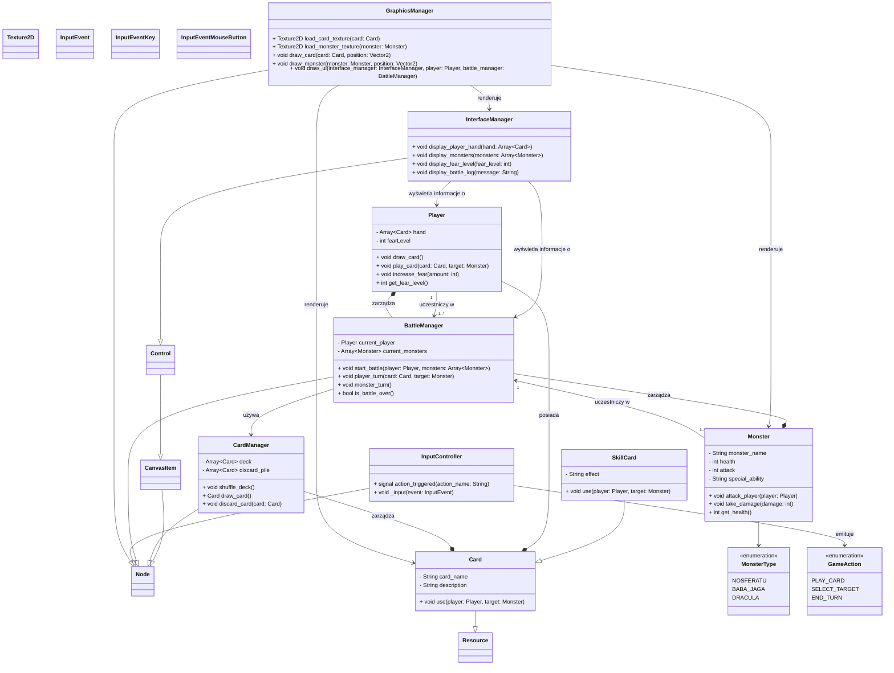

# Folklore Terror

## Opis
* __Karciana__ gra __RPG__ wykorzystująca elementy _Roguelike'ów_.
* Motywem przewodnim jest __Horror__ oraz __Paraliż Senny__.

## Cel Projektu:
* Poszerzenie puli umiejętności praktycznych w zakresie m.in. __programowania__, __tworzenia "asset'ów"__, __opowiadania historii__ oraz __marketingu__.
* Stworzenie konkretnego przykładu pracy, który można zaprezentować przyszłym pracodawcom jako dowód posiadanych umiejętności i doświadczenia.
* Stworzenie produktu, który potencjalnie mógłby zostać wydany jako pełnoprawna gra.

## Fabuła
* Leżysz bezwładnie w łóżku, ciężki sen ustępuje miejsca _paraliżującemu strachowi_. Powieki są zbyt __ciężkie__, by je podnieść, a ciało odmawia posłuszeństwa. To __paraliż senny__. Ale tej nocy nie jesteś _sam_. Z mroku wyłaniają się __koszmarne zjawy__, czerpiące swą moc z najmroczniejszych zakamarków __ludowej wyobraźni__. _Nosferatu_ o przeszywającym spojrzeniu, _Baba Jaga_ z jej kościstą dłonią, _Drakula_ z jego hipnotycznym urokiem – te i inne monstra zbliżają się, a jedyną twoją bronią są przebłyski świadomości i resztki woli, ucieleśnione w postaci __kart umiejętności__.

## Rozgrywka
* W _"Folklore Terror"_ każda runda reprezentuje __narastający atak koszmaru__. Na początku każdej rundy __losujesz karty stworów__, które będą cię nękać. Każdy stwór posiada unikalne statystyki i zdolności specjalne, od wysysania energii po paraliżowanie twoich zmysłów.
* Twoją jedyną linią obrony jest _talia kart umiejętności_. __Karty__ te reprezentują różne __aspekty twojej psychiki__ i __przebłyski świadomości__, które możesz wykorzystać, by odeprzeć atak. Znajdziesz wśród nich karty takie jak:
  1. _Wola Walki_: Pozwala na chwilowe odparcie ataku i zmniejszenie strachu.
  2. _Racjonalizacja_: Podważa nadprzyrodzoną naturę potworów, osłabiając ich.
  3. _Jasny Umysł_: Umożliwia przewidzenie ruchu wroga i uniknięcie jego ataku.
  4. _Wspomnienie Bliskich_: Dodaje otuchy i wzmacnia twoją obronę.
  5. _Przenikliwy Krzyk_: Ogłusza potwora na jedną turę.
* W swojej turze zagrywasz __karty umiejętności__, starając się zneutralizować zagrożenie ze strony nadciągających _monstrów_. Musisz strategicznie zarządzać swoimi __zasobami__ i przewidywać ruchy wrogów. Niektóre karty mogą być __bardziej efektywne__ przeciwko konkretnym __typom potworów__. Na przykład, _"Światło Księżyca"_ może osłabić __Nosferatu__, a _"Zioła Ochronne"_ mogą zdezorientować __Babę Jagę__.
* Jeśli nie uda ci się odeprzeć wszystkich atakujących stworów, ich obecność zwiększy poziom twojego __strachu__. Jeśli poziom strachu osiągnie _krytyczny punkt_, koszmar cię pochłonie i __przegrywasz__.
* Gra oferuje różne poziomy trudności, wprowadzając coraz bardziej złożone kombinacje potworów i ograniczając twoje zasoby. Możesz także odblokowywać nowe karty umiejętności w miarę postępów, odkrywając nowe sposoby na walkę z nocnymi marami.
  
* _"Folklore Terror"_ to klimatyczna i trzymająca w napięciu gra karciana, która łączy mechanikę strategiczną z mroczną atmosferą ludowych legend i klaustrofobicznym doświadczeniem paraliżu sennego. Czy zdołasz pokonać demony nocy? Czy może ich mroczna obecność stanie się twoją _wieczną rzeczywistością?_

## Grafika Koncepcyjna

## Wykorzystany folklor, stwory (lista może ulec zmianie):
* Banshee
* Medusa
* Baba Yaga
* Nosferatu
* Chupacabra
* Kraken
* Dracula
* Nuckelavee
* Dullahan
* Manticore
* Wendigo
* Skinwalker

## Technologie
### __Silnik Gry__: 
* Do stworzenia gry użyję popularnego silnika __Godot Engine__. Zdecydowałem się na ten wybór ze względu na __łatwy dostęp__, __niskie wymagania__ oraz dostępną i dobrze napisaną __dokumentację__.
* Używanym językiem programowania będzie __C#__.
### __Grafika__:
* Gra będzie używać prostych grafik w stylu __PixelArt__ stworzonych przeze mnie w programie __Aseprite__.
### __Muzyka__: 
* Do tworzenia muzyki oraz efektów dźwiękowych wykorzystam program __Ableton Live__ wraz z instumentami VST __LABS__ oraz __Native Instuments__. Pluginy te mają szeroką gamę tzw. _Dźwięków Ambient'owych_, które będą kluczowe by oddać terror rozgrywki.
### __Inne__: 
* Github oraz Git do zarządzania projektem.
### __Wsparcie__: 
* Gra będzie wspierała jedynie środowisko __Windows__ oraz język __Polski__.

## Diagram UML

